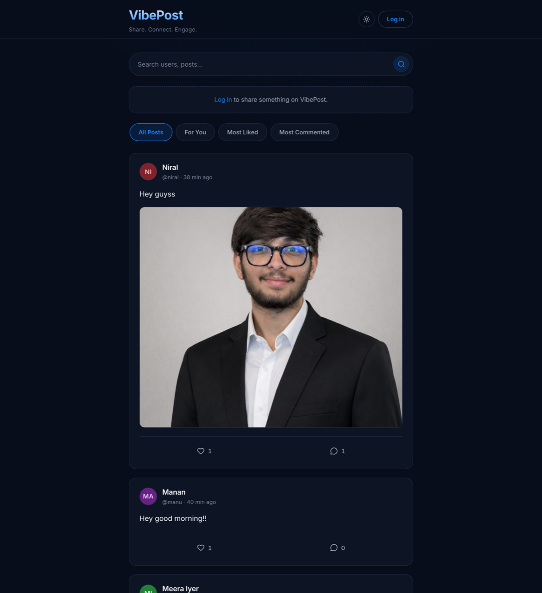
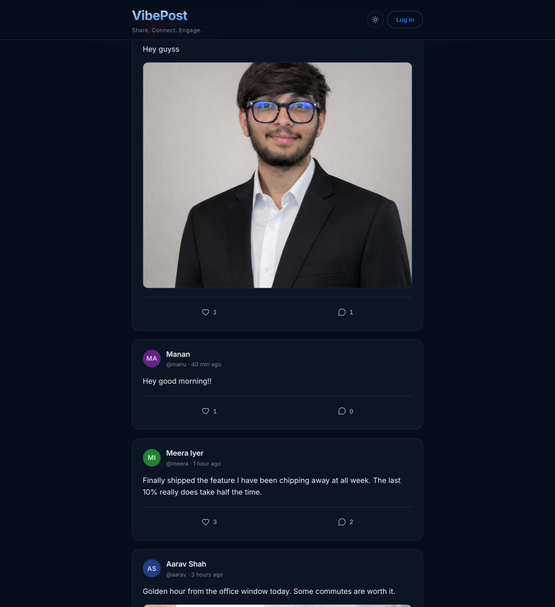
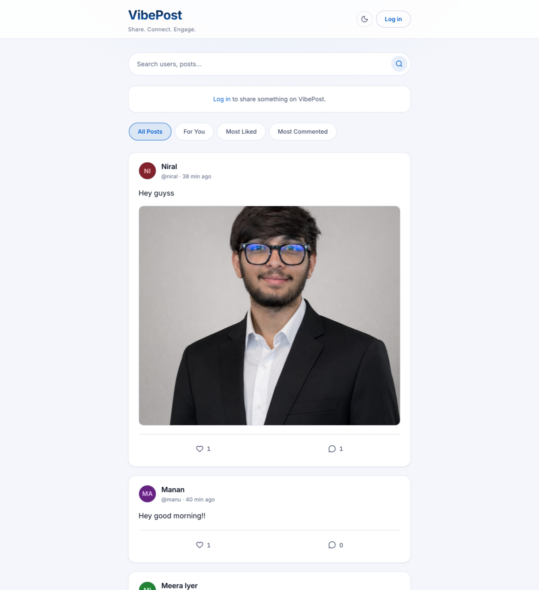
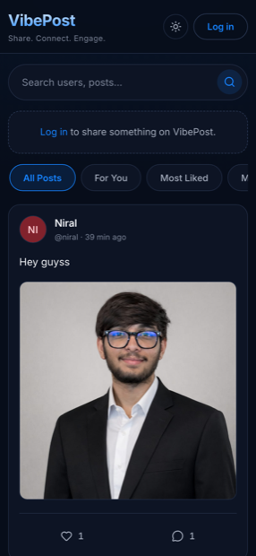

# VibePost

**Share. Connect. Engage.**

A mini full-stack social platform built for the 3W Full Stack Internship — Round 1 assignment.
Users can sign up, log in, publish posts (text, image, or both), browse a public feed, like/unlike
posts, and comment on them.

> Built with React + Vite on the frontend and Node/Express/MongoDB on the backend.
> No TailwindCSS — the entire UI is hand-written CSS Modules on a dark navy design system.

## Live

| | |
| --- | --- |
| **App** | https://vibepost-chi.vercel.app |
| **API** | https://vibepost-api.onrender.com |

> The API runs on Render's free tier, which sleeps after inactivity. The first
> request after an idle period can take up to a minute to wake it.



---

## Screenshots

**Feed** — posts, engagement counts and relative timestamps.



**Light theme** — the header toggle switches the whole palette.



| Mobile | Sign up |
| --- | --- |
|  |  |

---

## Tech Stack

| Layer | Technology |
| --- | --- |
| Frontend | React, Vite, React Router, Axios, CSS Modules, Lucide icons |
| Backend | Node.js, Express, Mongoose |
| Database | MongoDB Atlas (`users` + `posts` — exactly two collections) |
| Auth | JWT + bcryptjs |
| Images | Cloudinary |
| Hosting | Vercel (frontend) · Render (backend) · MongoDB Atlas (database) |

---

## Project Structure

```
VibePost/
├── backend/     Express API — auth, posts, likes, comments
├── frontend/    React client — feed UI, composer, auth screens
└── docs/        Assignment specification documents
```

---

## Getting Started

### Prerequisites

- Node.js 18+
- A MongoDB Atlas connection string
- A Cloudinary account (only required for image uploads)

### 1. Clone

```bash
git clone https://github.com/purpoint/VibePost.git
cd VibePost
```

### 2. Backend

```bash
cd backend
npm install
cp .env.example .env   # then fill in your own values
npm run dev
```

The API starts on `http://localhost:5050`.

> On macOS, port 5000 is taken by the AirPlay Receiver, so VibePost defaults to 5050 locally.
> Render supplies its own `PORT` in production.

### 3. Frontend

```bash
cd frontend
npm install
cp .env.example .env   # then fill in your own values
npm run dev
```

The app starts on `http://localhost:5173`.

---

## Environment Variables

Real `.env` files are never committed — only `.env.example`. In production the
same variables are set in the Render and Vercel dashboards.

### `backend/.env`

| Variable | Required | Description |
| --- | --- | --- |
| `PORT` | no | Local port (defaults to 5000). Render supplies its own. |
| `MONGODB_URI` | yes | MongoDB Atlas connection string |
| `JWT_SECRET` | yes | Secret used to sign JWTs — 32+ random characters |
| `JWT_EXPIRES_IN` | no | Token lifetime, defaults to `7d` |
| `CLIENT_URL` | in production | Allowed browser origin(s), comma-separated, no trailing slash |
| `NODE_ENV` | in production | Set to `production` so internal error detail is masked |
| `AUTH_RATE_LIMIT_MAX` | no | Credential attempts per IP per 15 minutes (defaults to 20) |
| `CLOUDINARY_CLOUD_NAME` | for images | Cloudinary cloud name |
| `CLOUDINARY_API_KEY` | for images | Cloudinary API key |
| `CLOUDINARY_API_SECRET` | for images | Cloudinary API secret — server only, never sent to the browser |

The API refuses to start in production if `CLIENT_URL` is missing, still points
at localhost, carries a path or trailing slash, or if `JWT_SECRET` is the
example value. Without Cloudinary credentials the API still runs and text posts
work; only image uploads report that storage is unconfigured.

### `frontend/.env`

| Variable | Required | Description |
| --- | --- | --- |
| `VITE_API_URL` | yes | Base URL of the API, including `/api` |

Vite inlines this at build time, so it must be set **when the build runs**.
`npm run build` inspects the output and refuses to ship a bundle that still
contains the development fallback when building on a deployment platform.

---

## Deployment

Three services: the database on MongoDB Atlas, the API on Render, the client on
Vercel. Images live on Cloudinary. Each holds its own credentials; nothing
sensitive is in this repository.

```
Vercel (React)  ──HTTPS──▶  Render (Express)  ──▶  MongoDB Atlas
                                   │
                                   └──▶  Cloudinary (post images)
```

### 1. MongoDB Atlas

1. Create a free cluster and a database user with a strong password.
2. Under **Network Access**, allow Render to connect. Render's outbound
   addresses are not fixed on the free plan, so `0.0.0.0/0` with a strong
   password is the practical option.
3. Copy the connection string and append the database name, e.g.
   `...mongodb.net/vibepost?retryWrites=true&w=majority`.

The application creates exactly two collections, `users` and `posts`. Likes and
comments are embedded inside post documents, not stored separately.

### 2. Cloudinary

1. Create an account; the dashboard shows the cloud name, API key and API
   secret.
2. Put all three in the Render environment. The secret is only ever used by the
   API to sign uploads — the browser posts files to VibePost's own endpoint and
   never talks to Cloudinary directly.

### 3. Render (API)

The repository contains a `render.yaml` blueprint, so **New → Blueprint** picks
up the settings. To configure it by hand instead:

| Setting | Value |
| --- | --- |
| Root directory | `backend` |
| Build command | `npm ci` |
| Start command | `npm start` |
| Health check path | `/api/health` |

Then set the environment variables from the backend table above. `CLIENT_URL`
must be the deployed frontend origin, e.g. `https://vibepost.vercel.app` — no
trailing slash, or it will never match a browser's `Origin` header.

Confirm the service is healthy:

```bash
curl https://<your-api>.onrender.com/api/health
```

`database` should read `connected`.

> Render's free tier sleeps after inactivity, so the first request after an idle
> period can take up to a minute.

### 4. Vercel (client)

| Setting | Value |
| --- | --- |
| Root directory | `frontend` |
| Framework preset | Vite |
| Build command | `npm run build` |
| Output directory | `dist` |

Set `VITE_API_URL` to the deployed API including `/api`, e.g.
`https://vibepost-api.onrender.com/api`, then redeploy so the value is baked in.

`frontend/vercel.json` rewrites unmatched paths to `index.html`, so refreshing
on `/feed` or opening a direct link is handled by React Router instead of
returning 404.

### 5. Verify the deployment

```bash
cd backend && npm run smoke -- https://<your-api>.onrender.com
```

This exercises the live API: auth, posts, image uploads, likes, comments, the
feed controls and the security behaviour, then deletes the posts it created. It
leaves behind two throwaway accounts, which it names at the end — there is no
account-deletion endpoint, so remove them from Atlas if you want a clean
database.

---

## Image Uploads

Post images are stored on Cloudinary, never in MongoDB and never on the API
server's disk — Render wipes its filesystem on every deploy, which would take
uploaded files with it. The post document keeps only the hosted URL.

`POST /api/posts` accepts either plain JSON for a text-only post, or
`multipart/form-data` with an optional `image` file:

| Field | Type | Notes |
| --- | --- | --- |
| `text` | string | Optional if an image is attached; max 1000 characters |
| `image` | file | Optional if text is given; JPG, PNG, WEBP or GIF, max 5MB |

A post must carry text, an image, or both — a request with neither is rejected.
Uploads are checked twice: the declared content type must be on the allowlist,
and the file's actual leading bytes must match a supported image format, so a
script renamed `.png` is refused.

Without Cloudinary credentials the API still runs and text-only posts work
normally; only an attempted upload reports that storage is unconfigured.

---

## Documentation

Specification documents live in [`docs/`](./docs):

- [`prompt.md`](./docs/prompt.md) — assignment requirements
- [`architecture.md`](./docs/architecture.md) — system architecture
- [`design.md`](./docs/design.md) — UI/UX specification
- [`milestone.md`](./docs/milestone.md) — development milestones
- [`techstack.md`](./docs/techstack.md) — technology decisions

---

## Features

- Email and password accounts with JWT authentication and session restore
- Posts containing text, an image, or both — empty posts are rejected
- Public feed readable without an account; posting, liking and commenting require one
- Likes and comments, with the username of everyone who liked or commented stored
- Feed sorting: All Posts, For You, Most Liked, Most Commented
- Debounced search across post text and author names
- Paginated loading with stable ordering
- Light and dark themes
- Responsive from 375px upwards, with keyboard navigation and AA colour contrast

---

## Testing

```bash
cd backend && npm test          # 106 tests against an in-memory MongoDB
npm run smoke -- <api-url>      # 61 checks against a running deployment
```
